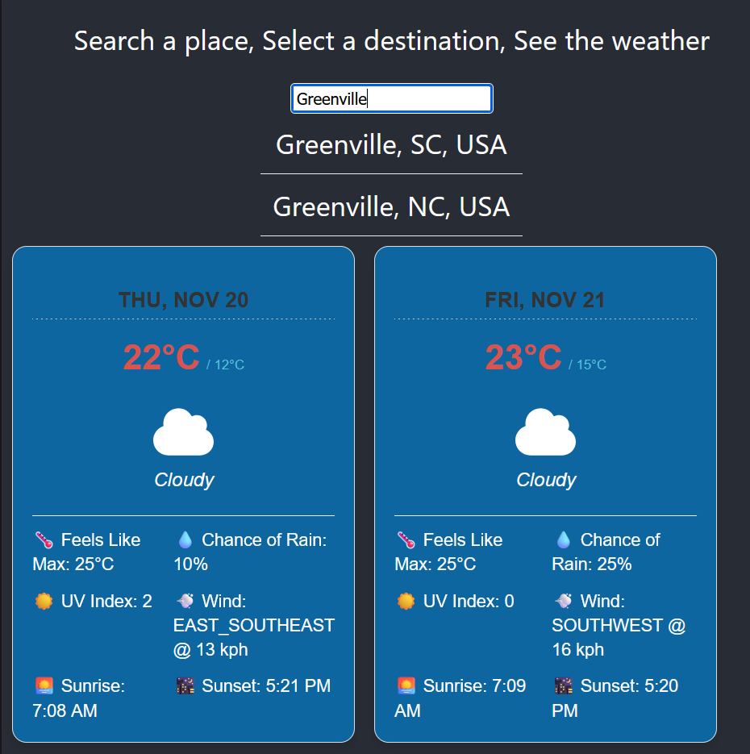
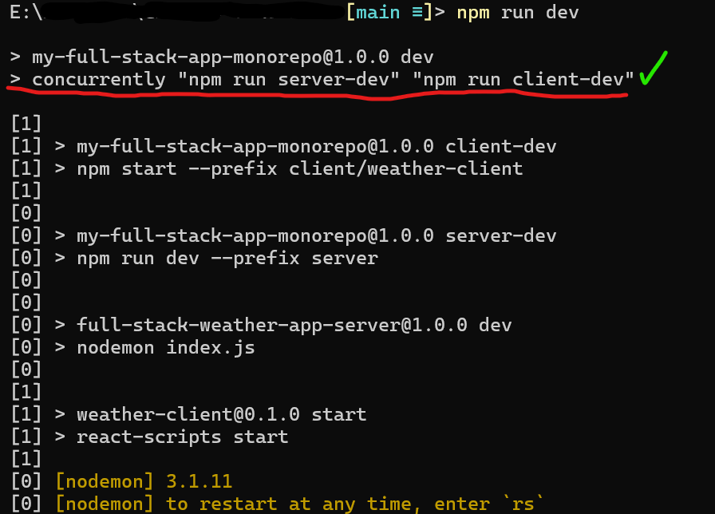

# Weather forecast app
Search for a place, Select a location, and see the forecast for that area.

### Tech stack:
- React (TS) Frontend
- Nodejs (Express) Backend
- Google API's
    - Places
    - Geolocation
    - Weather

### Run this locally:
1. Clone the repo and install necessary packages (npm i)
2. (From root) run "npm run dev"
    - this should start both backend and frontend together using concurrently

